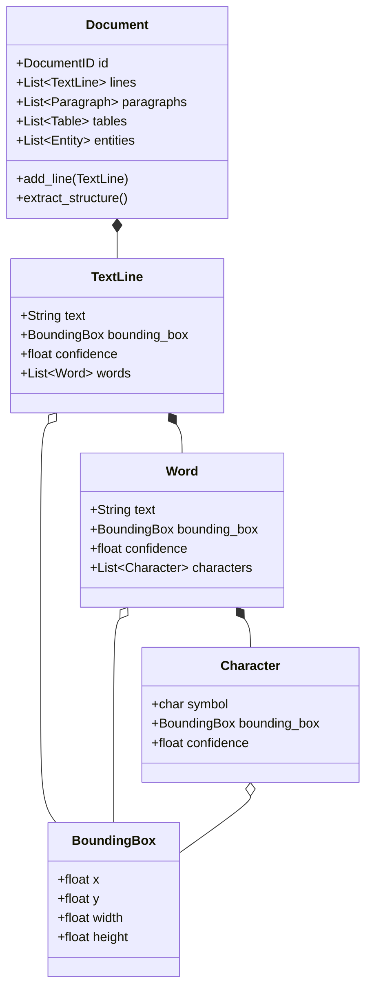
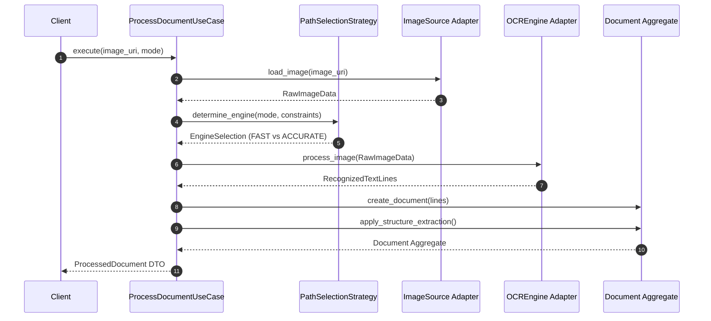

# System Architecture & Design Specification

> **Appllied — OCR System Architecture**  
> Standards Alignment: ISO/IEC 25010 (Software Quality) & ISO/IEC 12207 (SDLC)

---

## 1. High-Level Architecture (Hexagonal / Ports & Adapters)

The Appllied OCR system is built upon **Hexagonal Architecture** (Ports & Adapters) combined with **Domain-Driven Design (DDD)**. The primary goal is decoupling the core business logic from external frameworks, storage layers, and OCR hardware engines (such as Apple's Vision framework or CoreML ANE models).

```mermaid
graph TD
    subgraph "External Drivers / Primary Adapters"
        CLI["CLI Scripts (ocr-extract, ocr-extract-pdf)"]
        API["HTTP / Application Callers"]
    end

    subgraph "Application Layer"
        UC1["ProcessDocumentUseCase"]
        UC2["ExtractStructureUseCase"]
        UC3["SearchDocumentsUseCase"]
        S1["PathSelectionStrategy"]
        S2["LanguageCorrectionService"]
    end

    subgraph "Domain Layer (Pure Python Core)"
        AGG["Document Aggregate"]
        VO["BoundingBox / Language Value Objects"]
        EV["Domain Events (OCRCompleted, etc.)"]
        HIER["TextLine -> Word -> Character"]
    end

    subgraph "Ports (Interfaces)"
        P_OCR["OCREngine Port"]
        P_IMG["ImageSource Port"]
        P_REPO["DocumentRepository Port"]
    end

    subgraph "Infrastructure Layer / Secondary Adapters"
        A_VIS["VisionOCRAdapter (Apple Vision Framework)"]
        A_ML["CustomModelOCRAdapter (CoreML / ANE)"]
        A_FILE["LocalFileImageSource"]
        A_HTTP["HttpImageSource"]
        A_REPO["InMemoryDocumentRepository"]
    end

    CLI --> UC1
    API --> UC1
    UC1 --> S1
    UC1 --> S2
    UC1 --> P_OCR
    UC1 --> P_IMG
    UC1 --> P_REPO
    P_OCR <|.. A_VIS
    P_OCR <|.. A_ML
    P_IMG <|.. A_FILE
    P_IMG <|.. A_HTTP
    P_REPO <|.. A_REPO
    UC1 --> AGG
    AGG --> HIER
    AGG --> VO
    AGG --> EV
```

---

## 2. Domain-Driven Design (DDD) Structure

### Domain Entities & Aggregate Hierarchy

The domain layer has **zero external dependencies**. All data structures are immutable value objects or entities controlled by the `Document` aggregate root.



---

## 3. Two-Path Recognition & Execution Flow

Following Apple Vision framework design principles, the engine supports two distinct execution paths:

- **FAST Path**: Optimized for real-time text rectangle detection and character scanning.
- **ACCURATE Path**: Deep learning model pipeline with language model beam search and language correction.



---

## 4. Layer Dependency Rules

1. **Domain Layer (`ocr_system/domain/`)**:
   - Contains pure business models, domain events, and value objects.
   - Must **NEVER** import from `application`, `infrastructure`, or third-party libraries (except stdlib).

2. **Application Layer (`ocr_system/application/`)**:
   - Contains use-case orchestrators and domain interfaces (Ports).
   - Depends only on the `Domain Layer`.

3. **Infrastructure Layer (`ocr_system/infrastructure/`)**:
   - Implements Ports defined in the Application layer (`VisionOCRAdapter`, `InMemoryDocumentRepository`, etc.).
   - Interacts with system frameworks (PyObjC, CoreML, Vision, Quartz).

4. **Composition Root (`ocr_system/container.py`)**:
   - Instantiates adapters and injects dependencies into application use cases.
