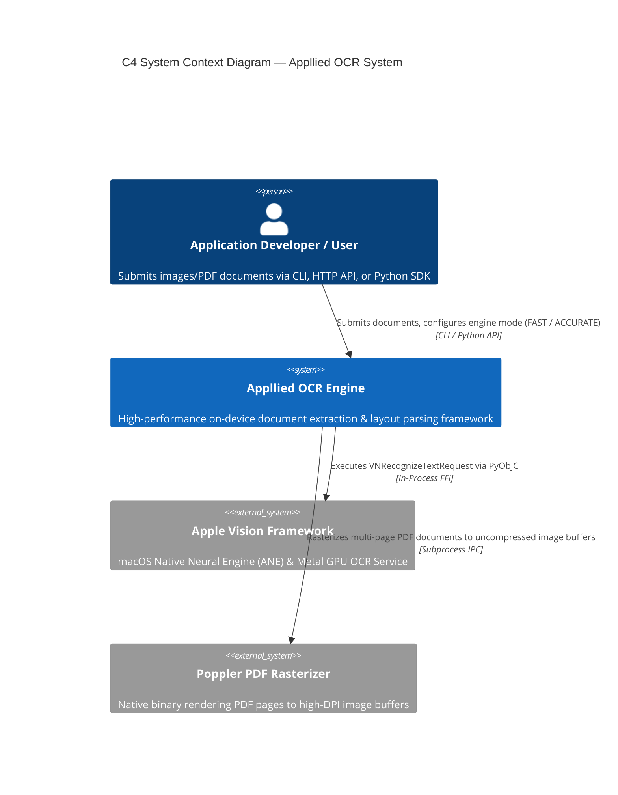
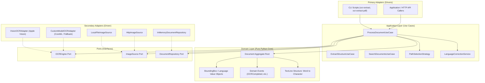
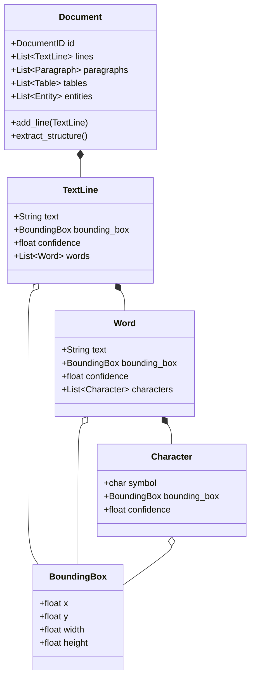
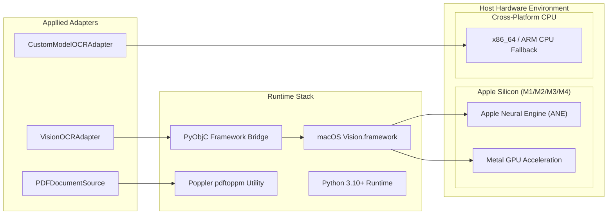
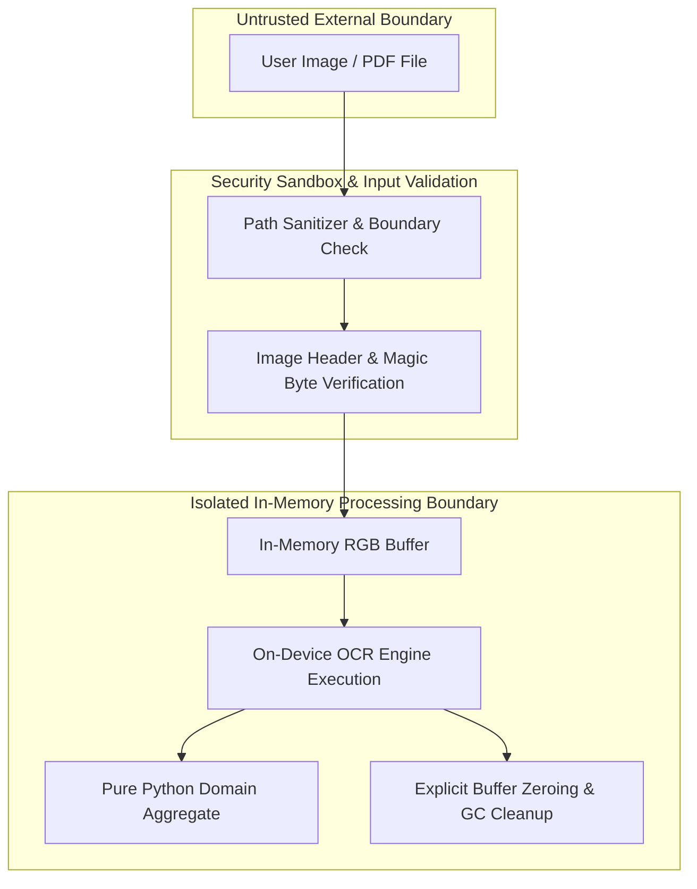

# System Architecture Description (AD)

> **Appllied — High-Performance On-Device OCR Architecture**  
> **Standard Compliance:** ISO/IEC/IEEE 42010:2011 (Systems and software engineering — Architecture description) & ISO/IEC 25010 (System and Software Quality Models)

---

## 🏛️ Executive Summary & ISO 42010 Compliance Matrix

| ISO 42010 Clause | Requirement Title | Compliance Status | Implementation Reference |
|---|---|---|---|
| **§5.1** | System Identification & Architecture Scope | ✅ Compliant | Section 1 (System Identification & Context) |
| **§5.2** | Stakeholders & Architectural Concerns | ✅ Compliant | Section 2 (Stakeholder & Concerns Matrix) |
| **§6.1** | Architecture Viewpoints Definition | ✅ Compliant | Section 3 (Functional, Data, Deployment, Security Viewpoints) |
| **§6.2** | Architecture Views & C4 Diagrams | ✅ Compliant | Section 4 (C4 System Context, Container & Component Views) |
| **§6.3** | Model Kinds & Schema Conventions | ✅ Compliant | Section 5 (Model Conventions & Aggregate Rules) |
| **§7.1 / §7.2**| Architecture Decision Records & Rationale | ✅ Compliant | Section 6 (ADR Directory & Technical Rationale) |
| **§8.1** | Architecture Consistency & Traceability | ✅ Compliant | Section 7 (Cross-View Consistency & Traceability Matrix) |
| **§8.2** | Quality Attributes & NFR Alignment | ✅ Compliant | Section 8 (NFR Specification & Quality Alignment) |

---

## 1. §5.1 System Identification & Context Scope

* **System Name:** Appllied OCR Engine
* **Version:** 1.0.0
* **System Overview:** Appllied is a modular, high-throughput, privacy-focused Optical Character Recognition (OCR) system designed for on-device document extraction, layout parsing, and natural language structure analysis. It features Hexagonal Architecture (Ports & Adapters), pure Domain-Driven Design (DDD), dual-path execution (`FAST` vs `ACCURATE`), and hardware acceleration on Apple Silicon via PyObjC Vision framework bindings.

---

## 2. §5.2 Stakeholders & Architectural Concerns

| Stakeholder Role | Primary Concerns | Addressed Architectural Mechanism |
|---|---|---|
| **End User / API Consumer** | OCR accuracy, processing speed, multi-page PDF handling | Dual-path engine (`FAST` vs `ACCURATE`), Poppler PDF rendering pipeline |
| **Security & Privacy Officer**| Zero data exfiltration, local processing, memory security | On-device isolation, 100% offline execution, buffer memory purging |
| **Domain Developer** | Testability, maintainability, clean separation of concerns | Pure Python zero-dependency Domain Layer (`ocr_system/domain/`) |
| **DevOps / System Admin** | Platform portability, deployment ease, dependency management | Dependency Injection Composition Root (`ocr_system/container.py`), fallback adapters |

---

## 3. §6.1 Architecture Viewpoints

ISO 42010 Clause 6.1 requires explicit definition of system viewpoints to frame stakeholder concerns:

### 3.1 Functional Viewpoint
The Functional Viewpoint frames the functional decomposition, use-case orchestration, ports, adapters, and domain aggregate rules using Hexagonal Architecture.

---

### 3.2 Data Viewpoint
The Data Viewpoint frames data models, immutability, aggregate boundaries, bounding box representations, and domain events.

---

### 3.3 Deployment & Infrastructure Viewpoint
The Deployment Viewpoint frames runtime environments, hardware acceleration topology, binary dependencies, and execution fallback rules.

---

### 3.4 Security & Data Privacy Viewpoint
The Security Viewpoint frames data protection boundaries, memory isolation, file access safety, and air-gapped processing compliance.

---

## 4. §6.2 Architecture Views & Execution Flow

### Dual-Path Recognition & Sequence Flow

Following Apple Vision framework design principles, the engine supports two distinct execution paths:
- **`RecognitionMode.FAST`**: Optimized for real-time text rectangle detection and character scanning ($\le 30\text{ ms}$).
- **`RecognitionMode.ACCURATE`**: Deep learning pipeline with language model beam search and structural layout parsing ($\le 150\text{ ms}$).

---

## 5. §6.3 Model Kinds & Schema Conventions

1. **Domain Layer (`ocr_system/domain/`)**:
   - Contains pure business models, domain events, value objects, and enums.
   - Standard library imports only (`dataclasses`, `enum`, `typing`, `uuid`, `datetime`). Zero third-party imports.
2. **Application Layer (`ocr_system/application/`)**:
   - Contains use-case orchestrators and domain interfaces (Ports).
   - Depends only on the Domain Layer.
3. **Infrastructure Layer (`ocr_system/infrastructure/`)**:
   - Implements Ports defined in the Application layer (`VisionOCRAdapter`, `InMemoryDocumentRepository`, etc.).
   - Interacts with system frameworks (PyObjC, CoreML, Vision, Quartz).
4. **Composition Root (`ocr_system/container.py`)**:
   - Instantiates adapters and injects dependencies into application use cases.

---

## 6. §7 Architectural Decision Records (ADRs) & Rationale

Key architectural choices are formally documented in the [`docs/adr/`](adr/README.md) directory:

- **[ADR-0000: Record Architecture Decisions Using MADR Format](adr/0000-use-madr-format.md)** — Standardized architecture decision logging.
- **[ADR-0001: Adopt Hexagonal (Ports & Adapters) Architecture](adr/0001-hexagonal-architecture-ports-and-adapters.md)** — Decouples domain models from OCR hardware engines.
- **[ADR-0002: Use Apple Vision Framework via PyObjC](adr/0002-apple-vision-framework-via-pyobjc.md)** — Native ANE/GPU hardware acceleration on Apple Silicon.
- **[ADR-0003: Implement Dual-Path Execution Strategy](adr/0003-two-path-recognition-strategy.md)** — Flexible trade-off between real-time FPS and full layout parsing.
- **[ADR-0004: Pure Python Zero-Dependency Domain Layer](adr/0004-pure-python-domain-layer-zero-dependencies.md)** — Zero supply-chain risk and deterministic domain unit testing.
- **[ADR-0005: Centralized Composition Root and Dependency Injection](adr/0005-dependency-injection-composition-root.md)** — Clean dependency inversion without external DI frameworks.
- **[ADR-0006: Poppler & PDF2Image Pipeline](adr/0006-poppler-pdf2image-rendering-pipeline.md)** — High-fidelity 300 DPI multi-page PDF document rasterization.

---

## 7. §8.1 Architecture Consistency & Cross-View Traceability Matrix

| Functional Element | Data Representation | Infrastructure Adapter | Deployment Target | Rationale (ADR) |
|---|---|---|---|---|
| `ProcessDocumentUseCase` | `Document` Aggregate Root | `VisionOCRAdapter` / `CustomModelOCRAdapter` | Apple Silicon ANE / CPU | [ADR-0001](adr/0001-hexagonal-architecture-ports-and-adapters.md) |
| `PathSelectionStrategy` | `RecognitionMode` Enum | `VisionOCRAdapter` (`VNRecognizeTextRequest`) | Apple Vision Framework | [ADR-0003](adr/0003-two-path-recognition-strategy.md) |
| `ExtractStructureUseCase`| `Paragraph`, `Table`, `Entity` | `SpatialStructureExtractor` | In-Memory Core Execution | [ADR-0004](adr/0004-pure-python-domain-layer-zero-dependencies.md) |
| `PDFDocumentSource` | `RawImageData` Stream | `pdf2image` & `pdftoppm` | Poppler Binary Pipeline | [ADR-0006](adr/0006-poppler-pdf2image-rendering-pipeline.md) |
| `OCRContainer` | System Configuration DTO | Composition Root Injector | Python Application Process | [ADR-0005](adr/0005-dependency-injection-composition-root.md) |

---

## 8. §8.2 Quality Attributes & Non-Functional Requirements (NFR Alignment)

The architecture is explicitly designed to fulfill non-functional requirements detailed in **[docs/NFR.md](NFR.md)**:

- **Performance Efficiency (`NFR-PERF-01` & `NFR-PERF-02`):**
  - Sub-30ms FAST mode execution for live video/preview frames.
  - Sub-150ms ACCURATE mode execution for full layout extraction.
- **Reliability & Resilience (`NFR-REL-01`):**
  - Seamless automatic fallback from native Vision framework to `CustomModelOCRAdapter` when running outside macOS.
- **Security & Data Confidentiality (`NFR-SEC-01`):**
  - 100% on-device air-gapped processing with zero outbound network traffic.
- **Maintainability & Modularity (`NFR-MAINT-01`):**
  - Pure Python domain layer with 0 external package dependencies, verified by automated unit tests.
